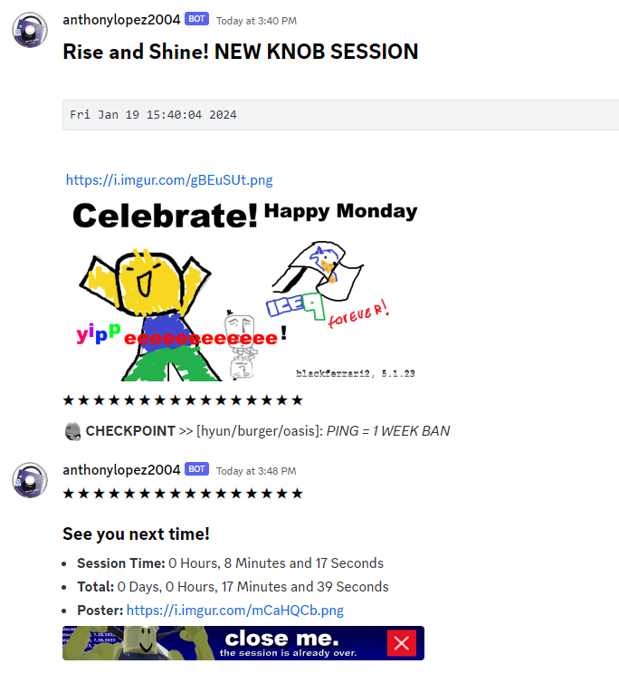
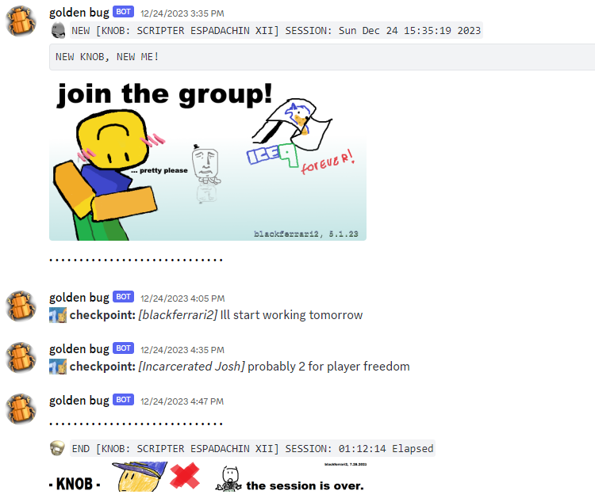

# SessionTrack
- Roblox studio plugin
- track how much time youve spent on projects
- NOTIFY EVERYBODY THAT YOURE WORKING
- start, end, pause, and resume sessions? this plugin really does it all

---

## see it in action

heres how its used on my own project called knob

    

another (older) screenshot, this is from a legacy version of the plugin but you can achieve same and BETTER results with this new version

    

---

## resources used

- famfamfam silk icons (original website is down)
- [Voyager](https://github.com/Jodenee/Voyager)
- [Signal](https://github.com/Sleitnick/RbxUtil/blob/main/modules/signal/init.lua)
- [t](https://github.com/osyrisrblx/t)

##### Thank you!